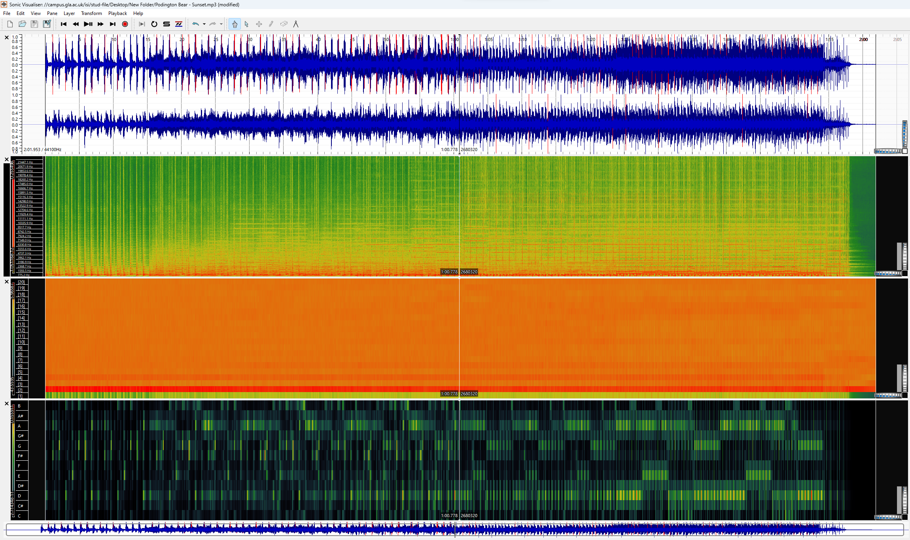

# MCA 2024 Lillian Weichelt
## Week 1
Title: Dawn, Project: Pride and Prejudice, Composer: Dario Marianelli, Time Period: 2005

There are quite a few struggles with working with music. One main one is if your selected pieces are not in the public domain. This makes it almost inaccessible and causes one to look either for free transcriptions or scans. The issue with transcriptions is that it may not always be accurate. Even if the score is easily accessible, the composer could be using unfamiliar techniques that a program like Cusescore cannot understand or reproduce.

The musical score I have found for my theme is a somewhat poor scan of a piano book for the Pride and Prejudice soundtrack. There are shadows and some measures have been slightly cut off. With some musical knowledge, listening to the audio recordings and looking at the metadata will fill these gaps. As a simple example, the name of the composer in the musical score was cut off, so I looked at my metadata and was able to fill in this information.

## Week 2
### Task: Identifying a piece of music related to my theme, then downloading it into Musescore and making corrections regarding rhythm and pitch.
When converting this piece to Musescore, the program added two extra staves for voice even though it was not included in the original document. The original is just a piano piece. Aside from this, it did not include many things from the original. It ignored the duplets in the top line of measure 3, excluding the last two notes in the measure. In the same measure it also only kept the first two notes in the left hand. It also had an issue interpreting the duple in the left hand in measures 5 and 9, but it includes the correct pitches. More rhythm issues happen in measure two where the dotted quarter E is only notated as a quarter. This also happens to the D in the left hand in measure 8. Pitch issues occur mostly when notes are completely gone such as in measure 7 where it should be a series of eighth notes (e, c, e, g, b, c) and is instead five quarter notes that consist of only the first five notes of the measure. This also happens in measure 11 when instead of being written as three eighth notes (e, g#, e) it is written as just a quarter E. A rest is also not included in measure 8. Other than pitch and rhythm, the system notes, some ties, the title, and the composer are not included.

Compare the original and edited versions of the piece here:

## Week 3
### Task 1: Exporting my score which was created last week to MusicXML and MEI.
Access the exported MusicXML and MEI files here:

[MusicXML](/data/DawnTranscription.musicxml) 
[MEI](/data/DawnTranscription.mei)

### Task 2: Rendering the MEI file using Verovio in GitHub.
Here is a screenshot of my rendered MEI file in Verovio:

## Week 4
### Task 1: Generating a jSymbolic analysis of the piece, selecting range, mean pitch, most common pitch class, last pitch, and most common rhythmic value.

#### Here are the results:
Range: 41

Mean Pitch: 70

Most Common Pitch Class: 4

Last Pitch: 84

Most Common Rhythmic Value: 0.5

### Task 2: Using the Python notebook on the Moodle to generate a piano roll, scatter plot, and pitch histogram of my piece using music21. 

#### Piano Roll:

#### Scatter Plot:

#### Pitch Histogram:

## Week 5
### Task 1: Creating a metadata schema of at least 5 elements, including title, artist, publisher, and at least two others of my choice. 
Here are my choices of metadata and what exactly they provide information for:

#### Title: 
The name of the piece.

#### Artist: 
Depending on the piece, who wrote and/or performed the music.

#### Publisher:
Who or what company the piece of music is published by.

#### Subtitle:
Additional information about the piece, usually provided by the composer or an editor.

#### Date:
The specific date the piece was either written or published.

### Task 2: Modifying the MEI document according to the schema that has been created.

Updated MEI document (as of week 7):

[MEI](/data/DawnTranscriptionMEI(2).mei)

## Week 7
### Task 1: Create a second version of your MEI file with updated metadata.
This week, I updated my MEI by adding genre specifications and licensing data.

#### Here is all of the collected metadata:
Title: Dawn

Subtitle: From Pride and Prejudice (2005)

Artist: Dario Marianelli

Date: 2005

Publisher: Hal Leonard Corporation

Genre: Film score, Classical Music

### Task 2: Rendering the revised MEI metadata along with the score on an HTML page.
Here are links to to my rendered metadata and my MEI file:

[Verovio Link](https://lillianweichelt.github.io/MCA-2024/metaRAW.html)

[MEI](/data/DawnTranscriptionMEI(2).mei)

## Week 8
### Task 1: Identifying and downloading 3 music tracks relating to my theme which are different in their sound and style to my original track, and identifying and listing the most important technical and non-technical metadata associated with each track. 

Here is a graph comparing the data of my three tracks:

### Task 2: Performing a basic analysis of my 3 tracks in SonicVisualizer by generating a spectrogram. 

#### Twilight - Denys Kyshchuk

#### Sunset - Podington Bear

#### Sunrise - DubRahJah

### Task 2.2:
One advantage to using a spectrogram analysis as opposed to a waveform analysis is that it is far more dimensional than a waveform analysis. Spectrograms provide information about the changes of frequencies over time through their vertical lines and changes in amplitude through their colour. Waveforms simply provide visuals for change in amplitude over time. While listening to your audio and looking at a spectrogram simultaneously, you can see where musical motifs occur, and most of the time you can also see where each beat is hitting. This makes spectrograms a far more fruitful source of information about your specific audio than waveforms.

## Week 9
### Task 1: Extracting features of the 3 tracks by generating a spectrogram, a Mel Frequency Cepstral Coefficients, and a Chromagram.
#### (The order of audio analyses from top to bottom are: Spectrogram, MFCC, Chromagram)

#### Twilight - Denys Kyshchuk

#### Sunset - Podington Bear

#### Sunrise - DubRahJah

### Task 2: Computing and visualizing the raw features with histograms inside of Python.
#### Histograms computed from Spectrograms

#### Twilight - Denys Kyshchuk

#### Sunset - Podington Bear

#### Sunrise - DubRahJah

#### Histograms computed from MFCC's

#### Twilight - Denys Kyshchuk

#### Sunset - Podington Bear

#### Sunrise - DubRahJah

#### Histograms computed from Chromagrams

#### Twilight - Denys Kyshchuk

#### Sunset - Podington Bear

#### Sunrise - DubRahJah

### Task 2: Comparing MFCC Histograms
MFCC's measure the frequency spectrum of a sound signal. This makes them a took that can give one insight into genre classification, instrumentation, and timbral qualities. All three of my tracks vary in genre, instrumentation, and timbre and this can be seen through these MFCC histograms. Twilight begins with lower peaks and then begins to peak much higher as the histograms progress. This may be because, throughout the track, the artist introduces more dominant spectral features with a rise in MIDI strings and a drum pad. Sunset has a similar instrumentation, with digital strings and a drum pad but utilizes much lower frequencies throughout the piece. This can be observed by how wide the histograms are. The artist also introduces higher-pitched further into the track which is why they get thinner throughout the progression of histograms. Sunrise has a wide mix of frequencies, it being sample-based and instrumented with extremely digital sounds. It clearly has the histograms with the highest peaks because it is very punchy and contains very dominant spectral features. 

## Week 10
Task 1: Generating a similarity matrix using the CSV files from the 3 tracks.
Task 2: Transcribing the original track by converting the WAV file to MIDI using SonicVisualizer.

